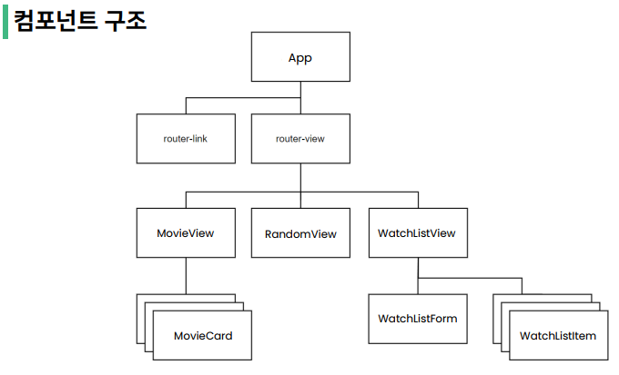
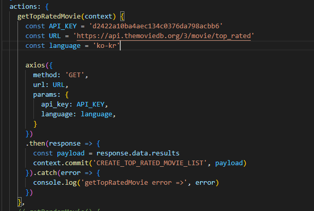

# 09_PJT_README

# 

## 1. 구현 과정

###### 

### 1) 컴포넌트 구조

- 주어진 컴포넌트 구조에 맞게 views 아래에 vue 파일을 만들어 router구조를 구현하였습니다.

- router>index.js에 path, name, component를 설정하여 views 아래 각 vue의 경로 설정하였습니다.

- 해당하는 컴포넌트에 하위 컴포넌트를 만들고 연결하였습니다.

# 

### 2) 최고 평점 영화들 출력 (Movie)

-  store>actions에서 API키를 받아 영화정보 json을 받았습니다.

- 받은 api 데이터를 비동기로 구현하기 위해 axios를 사용하였습니다.

- state에 영화 데이터를 받을 수 있는 topRatedList 리스트를 생성합니다.

- 비동기 데이터를 받으면 payload를 mutations의 CREATE_TOP_RATED_LIST로 commit 하고, 오류 시 콘솔에 getTopRatedMovie error : 오류 값을 산출합니다
  
  

- mutations의 CREATE_TOP_RATED_LIST에서 받은 payload 값을 state의 topRatedList에 push합니다.

- 

# 

### 3) 랜덤 영화 한개 출력 (Random)

- 

# 

### 4) 보고싶은 영화 등록&삭제 (Watch List)

- 

# 

### 5) 날씨에 따른 영화 추천(Weather)

- 

# 

## 2. 어려웠던 점 & 새로 배운 것

###### 

### 1) 어려웠던 점

- 랜덤 영화 정보 json을 받아와 화면에 구현하는 데에서 어려움을 겪었습니다.

# 

## 2) 새로 배운 것

- 

# 

## 3. 느낀점

- 

